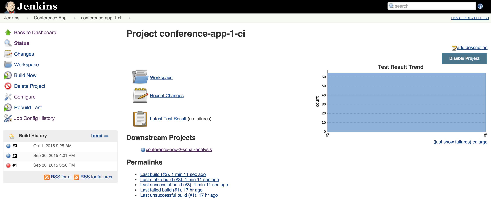
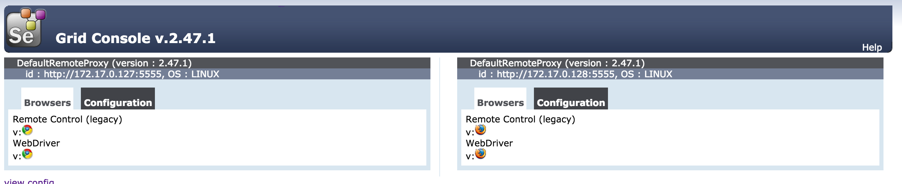

# CI Tools Demo

This GitHub repository contains Dockerfiles for running a set of Continuous Integration Tools with a single command. The diagram contains all tools used in the Docker containers.


Blog article on the CI Docker Container, https://blog.codecentric.de/en/2015/10/continuous-integration-platform-using-docker-container-jenkins-sonarqube-nexus-gitlab

# Getting started

To get all docker containers up and running, in __docker-ci-tool-stack__ use:

```
docker-compose up
```

## UPDATE for Linux Users

### Automatically

Please run **docker-compose.yml.native-docker-fix.sh** before executing **docker-compose up**.
This will fix the Docker binary PATH, see [Issue 24](https://github.com/marcelbirkner/docker-ci-tool-stack/issues/24).
This script patches the docker-compose.yml.

### Manually

Please alter Line 23 in docker-compose.yml under jenkins / volumes from

- /usr/local/bin/docker:/usr/bin/docker

to

- /usr/bin/docker:/usr/bin/docker

This is because '/usr/bin/docker' is the docker binary, see [Issue 24](https://github.com/marcelbirkner/docker-ci-tool-stack/issues/24).

## Access Tools

#### With docker machine

| *Tool* | *Link* | *Credentials* |
| ------------- | ------------- | ------------- |
| Jenkins | http://${docker-machine ip default}:18080/ | no login required |
| SonarQube | http://${docker-machine ip default}:19000/ | admin/admin |
| Nexus | http://${docker-machine ip default}:18081/nexus | admin/admin123 |
| GitLab | http://${docker-machine ip default}/ | root/5iveL!fe |
| Selenium Grid | http://${docker-machine ip default}:4444/grid/console | no login required |
| Conference App | http://${docker-machine ip default}:48080/currentSessions | no login required |

## Screenshots

Here is an overview of all tools:

- GitLab is used for storing the Source Code
- Jenkins contains build job and is triggered once projects in GitLab are updated
- As part of the CI build, Jenkins triggers a static code analysis and the results are stored in SonarQube
- The Maven build uses Nexus as a Proxy Repository for all 3rd party libs. The build artifacts are deployed to the Nexus Release Repository
- The Selenium Grid contains Docker containers running Chrome and Firefox and is used for UI tests

### Jenkins Jobs

There are several jobs preconfigured in Jenkins.
The Jobs cover the following tasks:

- Continuous Integration Build with Maven
- Unit Tests
- Static Source Analysis results are stored in SonarQube
- JaCoCo Test Coverage
- Deployment to Nexus
- Jenkins Job DSL examples
- Selenium UI Test




### SonarQube Dashboard


### Nexus Repository


### Selenium Grid


